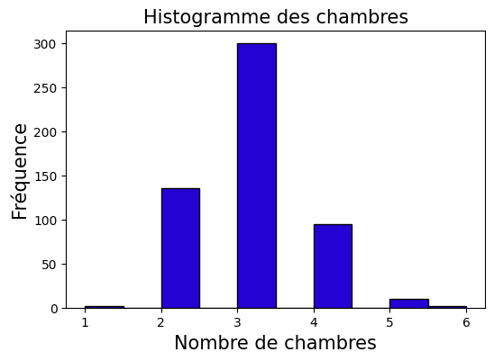
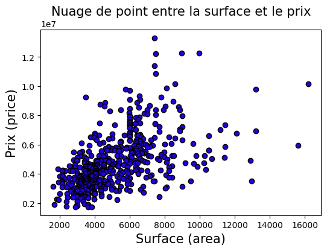

# Projet - Programmation Avancée en Python et Introduction à R

Ce document décrit les spécifications et les résultats du projet final pour le cours de Programmation Avancée en Python et Introduction à R.

---

## Tâche 1: Implémentation d'un sous-ensemble de NumPy en Python

### Description
Dans cette tâche, nous avons implémenté une classe Array en Python pur. La classe permet la création de tableaux 1D et 2D, ainsi que des opérations telles que l'addition, la soustraction, la multiplication, la division, et le produit scalaire sur les tableaux 1D.

### Implémentation

---

## Tâche 2: Tracé de Graphiques et Analyse de Données

### Analyse des Graphiques

#### Histogramme

L'histogramme montre la distribution du nombre de chambres dans les maisons les plus vendues. On peut observer que la plupart de ces maisons ont 3 ou 4 chambres, ce qui nous montre que la majorité des gens préfèrent les maisons de taille moyenne familiale.

#### Nuage de Points entre la surface et le prix des maisons.

On observe une tendance générale à la hausse, indiquant que les maisons avec une plus grande surface tendent à avoir un prix plus élevé. Cependant, il y a également une variabilité significative, suggérant que d'autres facteurs peuvent influencer les prix.

---

## Tâche 3: Petit Programme GUI en Python avec Tkinter

Rapport sur l'application de Génération d'Images avec Tkinter et Tiny-Stable-Diffusion
Introduction
Ce rapport présente une application développée en Python utilisant Tkinter pour l'interface utilisateur et la bibliothèque diffusers pour la génération d'images. L'application permet aux utilisateurs de saisir une description textuelle et de générer une image correspondante en utilisant le modèle de diffusion stable Tiny-Stable-Diffusion-Torch.

Description de l'Application
Objectif
L'objectif de cette application est de permettre la génération d'images à partir de descriptions textuelles fournies par l'utilisateur. Cette fonctionnalité peut être utilisée dans divers domaines, tels que l'art génératif, la visualisation de concepts, et la création de contenu visuel à partir de texte.

Interface Utilisateur
L'interface utilisateur de l'application est construite en utilisant le module Tkinter de Python. L'interface comprend les composants suivants :

Zone de texte : Permet à l'utilisateur de saisir une description textuelle.
Bouton "Générer" : Lance le processus de génération d'image.
Indicateur de chargement (Spinner) : Indique que le processus de génération est en cours.
Zone d'affichage pour l'image générée : Affiche l'image générée.
Label de résultats : Affiche des messages informatifs ou d'erreur.
Fonctionnalités
Saisie de la description textuelle : L'utilisateur peut saisir une description de l'image qu'il souhaite générer.
Génération d'image : Lorsqu'on clique sur le bouton "Générer", l'application utilise le modèle Tiny-Stable-Diffusion-Torch pour générer une image correspondant à la description.
Affichage de l'image générée : L'image générée est affichée dans l'interface utilisateur.
Gestion des erreurs : L'application affiche des messages d'erreur en cas de problème lors de la génération de l'image.
Détails Techniques
Modèle Utilisé
Le modèle utilisé pour la génération d'images est Tiny-Stable-Diffusion-Torch de Hugging Face. Ce modèle est une version légère du modèle de diffusion stable, optimisée pour une génération rapide sur des machines avec des ressources limitées.

Bibliothèques Utilisées
Tkinter : Utilisé pour créer l'interface graphique de l'application.
PIL (Python Imaging Library) : Utilisé pour manipuler et afficher les images générées.
diffusers : Bibliothèque de Hugging Face utilisée pour charger et utiliser le modèle de diffusion stable.
torch : Utilisé pour exécuter le modèle sur le GPU si disponible.
Fonctionnement
Chargement du modèle : Le modèle est chargé au début de l'application. Si le modèle ne peut pas être chargé, un message d'erreur est affiché et l'application se ferme.
Génération d'image : Lorsqu'un utilisateur saisit une description et clique sur "Générer", un nouveau thread est lancé pour générer l'image afin de ne pas bloquer l'interface utilisateur. Le modèle génère l'image à partir de la description, et l'image est affichée dans l'interface utilisateur.
Gestion des erreurs : Les erreurs lors de la génération d'image sont capturées et affichées à l'utilisateur.Voici une explication détaillée de chaque partie du code pour l'application de génération d'images avec Tkinter et le modèle Tiny-Stable-Diffusion-Torch.
Importation des bibliothèques nécessaires :

tkinter et ttk pour créer l'interface graphique.
filedialog pour gérer les dialogues de fichiers (bien que non utilisé dans ce code).
PIL (Python Imaging Library) pour manipuler et afficher les images générées.
threading pour exécuter la génération d'images dans un thread séparé, afin de ne pas bloquer l'interface utilisateur.
diffusers et torch pour charger et exécuter le modèle de diffusion stable.
Chargement du modèle :

Le modèle hf-internal-testing/tiny-stable-diffusion-torch est chargé via la bibliothèque diffusers.
Si un GPU est disponible (torch.cuda.is_available()), le modèle est déplacé vers le GPU pour accélérer les opérations ; sinon, il est utilisé sur le CPU.
En cas d'erreur lors du chargement du modèle, un message d'erreur est affiché et l'application se termine.
Fonction de génération d'image en arrière-plan :

La fonction generer est définie pour exécuter la génération d'image.
Le modèle génère l'image à partir de la description saisie et l'enregistre sous le nom image_generer.png.
L'image est ensuite redimensionnée et convertie en un objet PhotoImage de Tkinter.
Une fonction mise_a_jour_gui est définie pour mettre à jour l'interface graphique avec l'image générée et le message de résultat.
La mise à jour de l'interface graphique est programmée pour s'exécuter sur le thread principal via debut.after.
Si une erreur se produit pendant la génération, un message d'erreur est affiché et le spinner est désactivé.
La génération d'image est exécutée dans un thread séparé pour éviter de bloquer l'interface utilisateur.
Configuration de l'interface utilisateur :

Création de la fenêtre principale debut avec un titre et une taille définie.
Ajout d'une zone de texte text_taper pour saisir la description, positionnée en haut.
Ajout d'un bouton bouton_generer qui appelle la fonction generer_img lorsque cliqué.
Configuration d'un spinner ttk.Progressbar pour indiquer le chargement.
Ajout d'un label image_label pour afficher l'image générée.
Ajout d'un label label_resultat pour afficher des messages à l'utilisateur.
Lancement de la boucle principale de l'application avec debut.mainloop().

